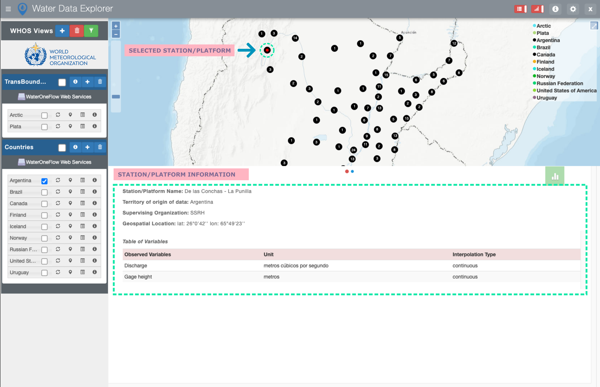
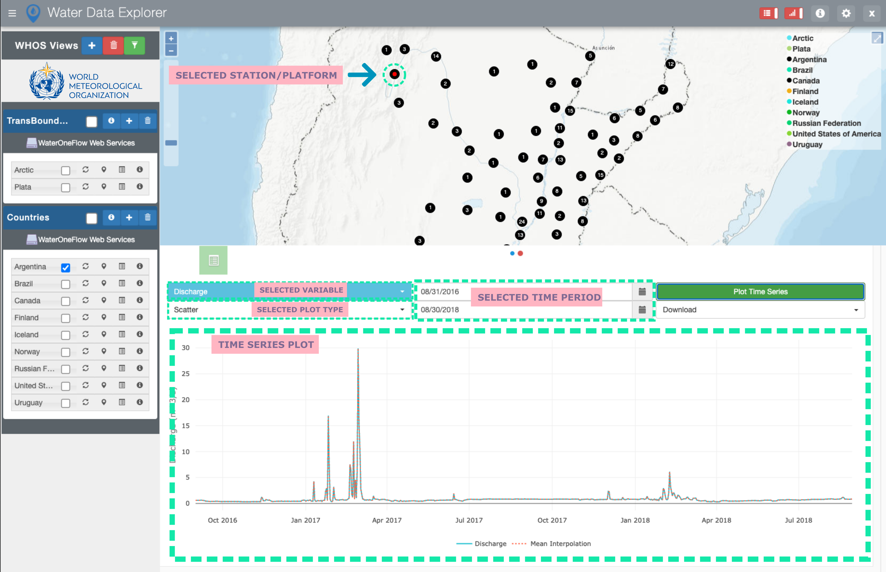

=========================
Water Data Explorer (WDE)
=========================

Introduction
************

In recent years, there has been a growing recognition of the need for standardized ways of sharing water data on the web.
In response to this need, the Consortium of Universities for the Advancement of Hydrologic Science (CUAHSI)
Hydrologic Information System (HIS) has been developed along with the standardized WaterOneFlow web services and WaterML
data exchange format. To access data that are shared using the WaterOneFlow services and WaterML format,
tools already exist such as the
`Microsoft Windows HydroDesktop software <https://www.sciencedirect.com/science/article/pii/S1364815212001053>`_ ,
`WaterML R package <https://github.com/jirikadlec2/waterml>`_, and the web-based `CUAHSI HydroClient <https://data.cuahsi.org/>`_ which serves as an access point to the `CUAHSI HIS <http://hiscentral.cuahsi.org/>`_ database.

Water Data Explorer (WDE) is a newly developed web-based tool allowing a broad range of users to discover, access, visualize, and download data from any Information System that makes available water data in WaterML format through WaterOneFlow services. WDE is designed in a way that allows users to customize it for local or regional web portals.

WDE Overview
************

WDE is an open-source web application providing users with the functionalities of data discovery, data access, data visualization, and data downloading from any Information System that makes available water data in WaterML format through WaterOneFlow web services. WDE  can be installed by any organization and requires minimal server space.

User Interface
--------------

To organize and manage various WaterOneFlow web services, WDE uses Data Views that are organized in Catalogs.

.. image:: images/1.1.png
   :width: 1000
   :align: center

Each Data View contains a set of data that is accessible through a specific WaterOneFlow web service.

The stations for which data are accessible through a specific Data View are displayed on the WDE map interface along with a legend of the respective Data Views.

.. image:: images/1.2.png
   :width: 1000
   :align: center

For each Station/Platform, a set of metadata is available in the Graphs Panel of the WDE User Interface. Also, for each Station/Platform, a table of observed variables is available and includes variable names, units, and interpolation types.

Station/Platform time series data can be plotted as “Scatter” or “Whisker and Box” plots, and be downloaded in CSV, `OGC NetCDF <https://www.ogc.org/standards/netcdf>`_ , `OGC WaterML 2.0 <https://www.ogc.org/standards/waterml>`_ , and `CUAHSI WaterML 1.0 <https://his.cuahsi.org/wofws.html>`_ formats for any available time period of interest in the Time Series Plots section.

Developers
----------

WDE has been developed by Elkin Giovanni Romero Bustamante
at `Brigham Young University's (BYU) Hydroinformatics laboratory <https://hydroinformatics.byu.edu/>`_
with the support of the World Meteorological Organization.
The BYU's Hydroinformatics laboratory focuses on delivering different software products and services for water modelling. Some of the most important works include:
`Global Streamflow Forecast Services API <https://hydroinformatics.byu.edu/global-streamflow-forecasts>`_ ,
creation of the `Tethys Platform <https://hydroinformatics.byu.edu/tethys-platform>`_ ,
and `Hydroserver Lite <http://128.187.106.131/Historical_Data_template.php>`_ . The most recent publications and works can be found on the BYU Hydroinformatics website.

Source Code
-----------

The WDE source code is available on Github:

  - https://github.com/BYU-Hydroinformatics/Water-Data-Explorer
