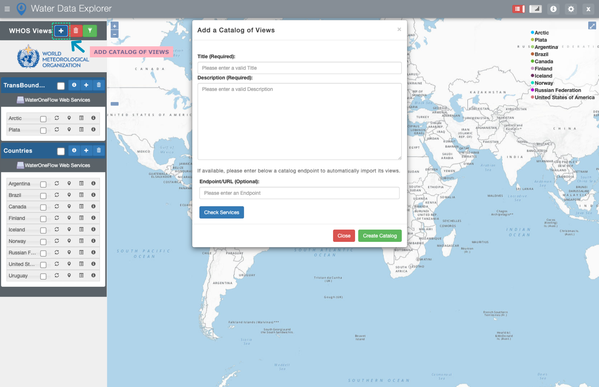
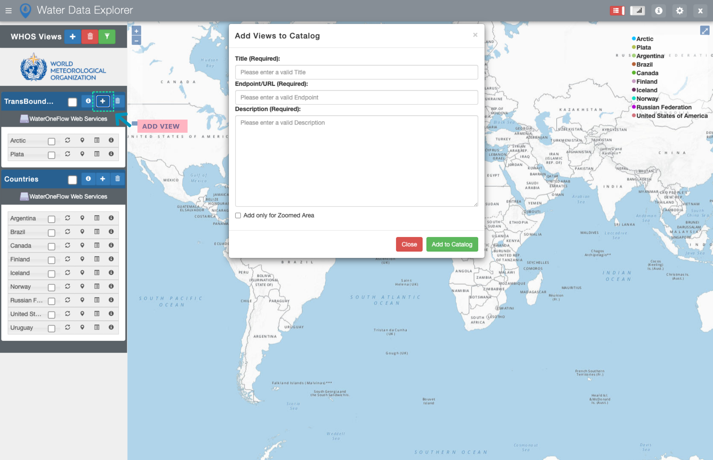

=========================
WDE Admin Functionalities
=========================

The WDE admin functionalities are only available for the WDE administrators.

Adding and Deleting Data Catalogs and Views
*******************************************

To add Catalogs, administrators should use the |add| icon to access the “Add a Catalog of Views” menu.

In this menu, to add a new Catalog of Views, administrators should enter its title, description, and endpoint if available.

.. note::
   .. image:: images/URL_add_catalog.png
      :align: center
      :scale: 75

   To add a Catalog that is already published and accessible through WaterOneFlow web services, administrators should enter the Catalog endpoint to automatically import its Views.
   Administrators can check the available Views by using the |check_services| button.

To delete Catalogs, administrators should use the |trash| icon to access the “Delete Catalogs” menu and select the Catalog to be deleted.

.. image:: images/1.10.png
   :width: 1000
   :align: center

To add Views to a specific Catalog, administrators should use the |add| icon to the right of  the Catalog’s title to access the “Add Views to Catalog” menu.

To delete Views, administrators should use the |trash| icon to access the “Delete Views” menu and select the View to be deleted.

.. image:: images/1.12.png
   :width: 1000
   :align: center

Customizing the WDE User Interface
**********************************

Administrators can customize the WDE user interface by selecting the |settings| icon.

.. image:: images/1.13.png
   :width: 1000
   :align: center

In the settings window, administrators can customize the name of the institution/system that provides Catalogs/Views to the WDE.
Administrators can also customize the institution/system logo, as well as the boundaries of the WDE map interface. These customizations are available in the Custom Settings table.
