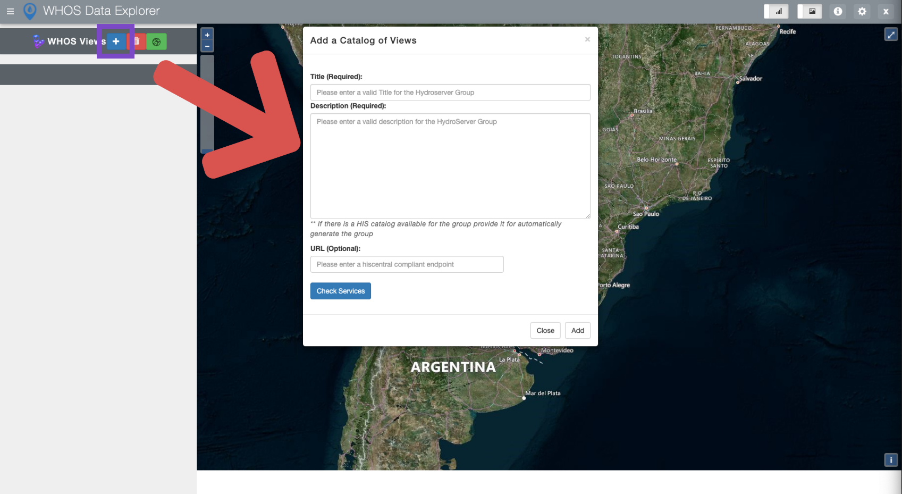
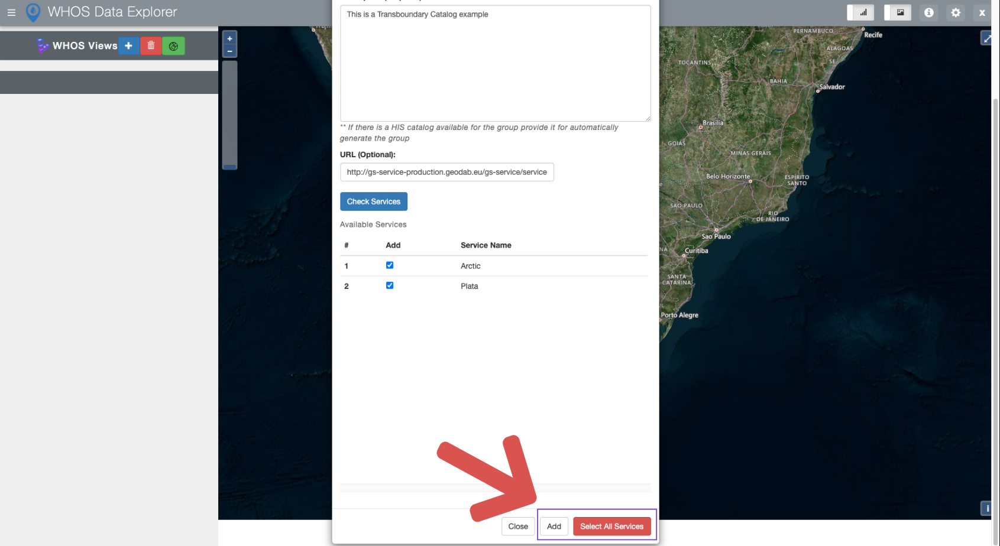

=============================
WDE User Functionalities
=============================

The Water Data Explorer is able to discover data from the different WHOS views such as the transboundary view. The Water Data Explorer can
check for the available data in this views, and it also is able to add the data from them

Steps for Data Discovery
************************

In this example for data discovering, we will use the transboundary view with the following endpoint:

- http://gs-service-production.geodab.eu/gs-service/services/essi/view/whos-country/hiscentral.asmx

We will start also in a new and fresh version of the Water Data explorer.
The following Figure shows how to access the Water Data Explorer menu for data discovery

Upon filling the require metadata from the menu. We will be able to click in the button "Check services" in order to see the available data in the View as suggested by the following Figure

.. image:: images/disc_catalog_sevs.png
   :width: 600

.. note::
   After see all the different available services, you can press the button check all to select all the services.

Once the services are selected, you can add by clicking the button "Add" as the following Figure suggest.

After it is finished the discovered services for the transboundary view will be added to the Water Data Explorer

.. image:: images/afeter_disc.png
	:width: 600
