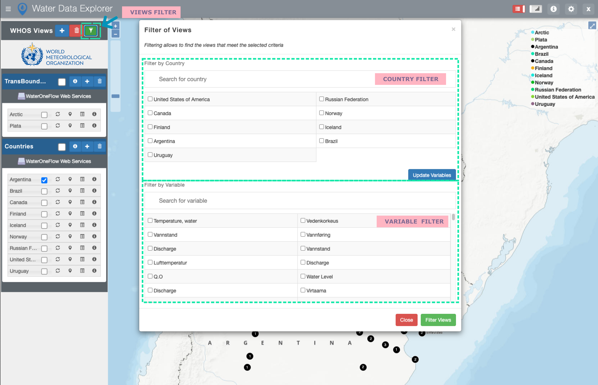
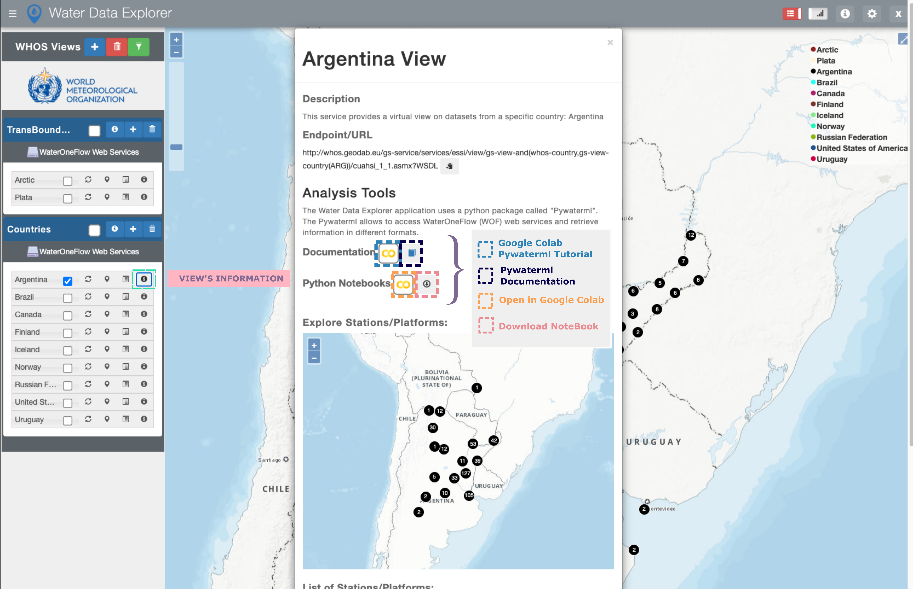

.. |colab| image:: images/colab_icon.png
   :scale: 15%

.. |document| image:: images/documentation.png
   :scale: 15%

========================
WDE User Functionalities
========================

Data Discovery
**************

The user can filter the available Views by countries and variables of interest by using the |filter| icon.

.. note::

   The user can update the variables to only display the variables of the selected countries in the country filter portion by
   using the |update_vars| button.

To display the available stations/platforms of a specific View on the map, the user should use the
“Show/Hide View” icon. To see the available variables of a specific View, the user should use the
|tables| icon. To display the information about a specific View including description, endpoint,
and list of stations as well as the available analysis tools, the user should use the |info| icon.
To zoom to a specific View on the map, the user should use the |marker| icon.

.. note::
   To have the data and information of a specific View up to date, the user should update the View by
   using the |update_view| icon.

.. image:: images/1.6.png
   :width: 1000
   :align: center

Data Analysis
*************

WDE application uses a python package called "Pywaterml". The Pywaterml allows access to WaterOneFlow (WOF) web services and retrieves information in different formats. The Pywaterml can be used in Python Notebook.

Users can open a Python notebook tutorial and the Pywaterml documentation by using the
|colab| and |document| icons.

For a selected View, users can open a Python notebook template in Google Colab. The Python notebook can also be downloaded for a specific station/platform and a specific variable.

Time Series Visualization and Downloading
*****************************************

To visualize and download time series available for a specific station, the user should select the
station of interest on the WDE map interface, that triggers the opening of the WDE Graphs Panel
at the bottom of the application. To select the time series of interest to be visualized or downloaded,
the user should select the |plots| icon on the top right of the Graphs Panel.

.. image:: images/1.8.png
   :width: 1000
   :align: center

.. note::
   User can hide or show the Graphs Panel by means of the |graph_panel| icon on the right of the application header.
   In the opened window, the user can select a variable of interest, plot type, and time period of interest.

.. note::
   .. image:: images/menu_plotly.png
      :align: center

   WDE uses the Plotly library which provides the menu above, to allow users to download plots in PNG format, pan to, zoom in/out, and autoscale plots.
